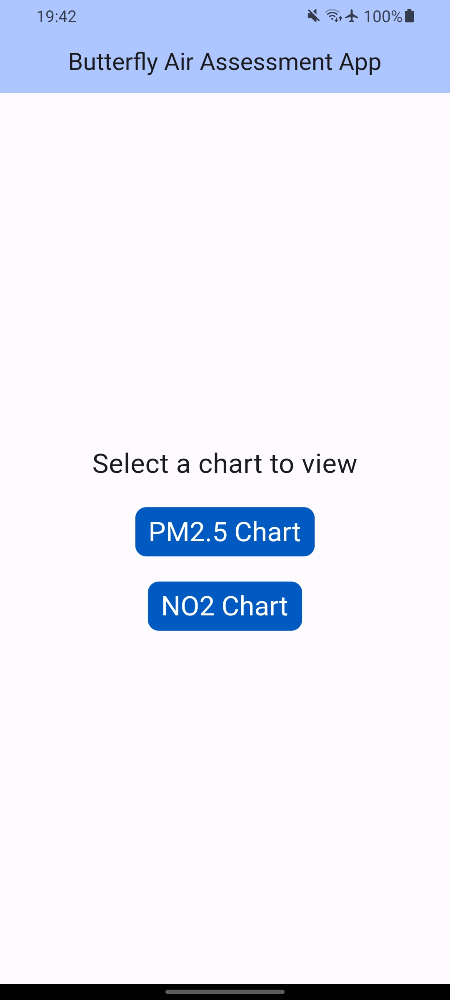
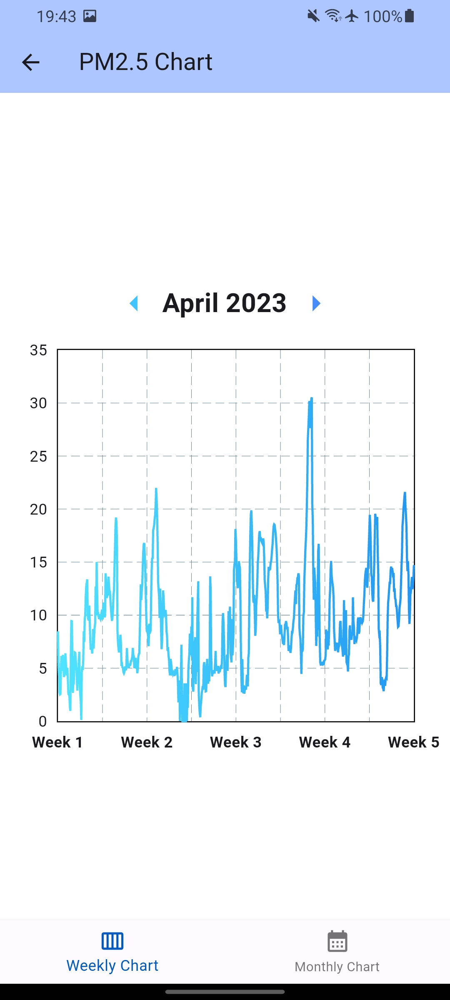
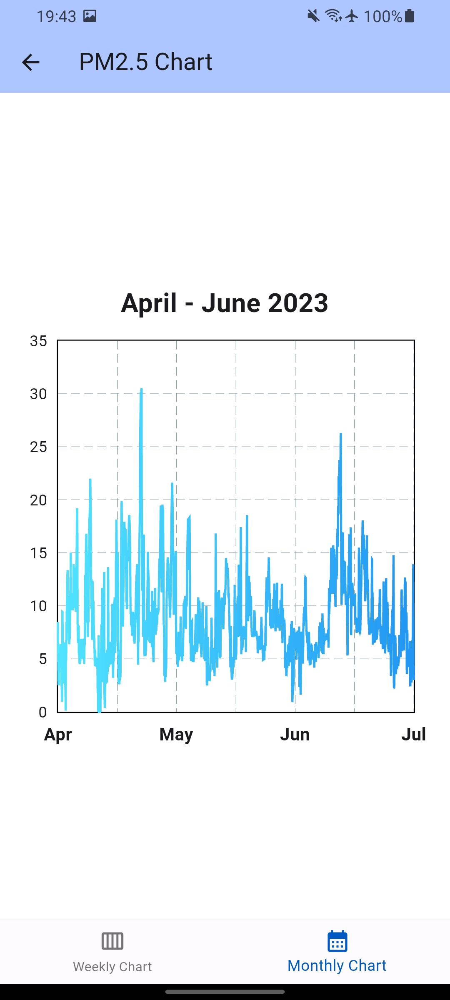
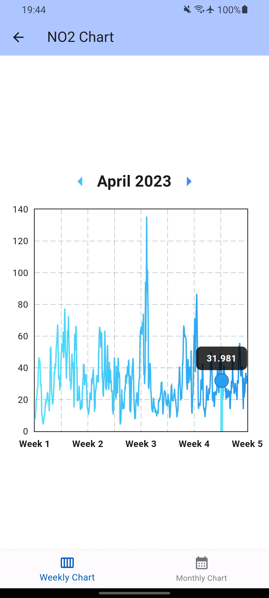

# Butterfly Air Assessment App

A mobile app that takes in outdoor Particulate Matter (PM2.5) and Nitrogen Dioxide(NO2) data from the Breathe London initiative, and plots in 1-hour interval graphs, specifically from South Kensington Underground station.

## Technologies Used
- Flutter
- Breathe London API
- Postman (API Testing)

## Features
- Weekly Chart with month changer
- Monthly Chart
- Chart Tooltip

## Screenshots

#### Home Screen

#### Weekly Chart Screen

#### Monthly Chart Screen

#### Tooltip on Chart

